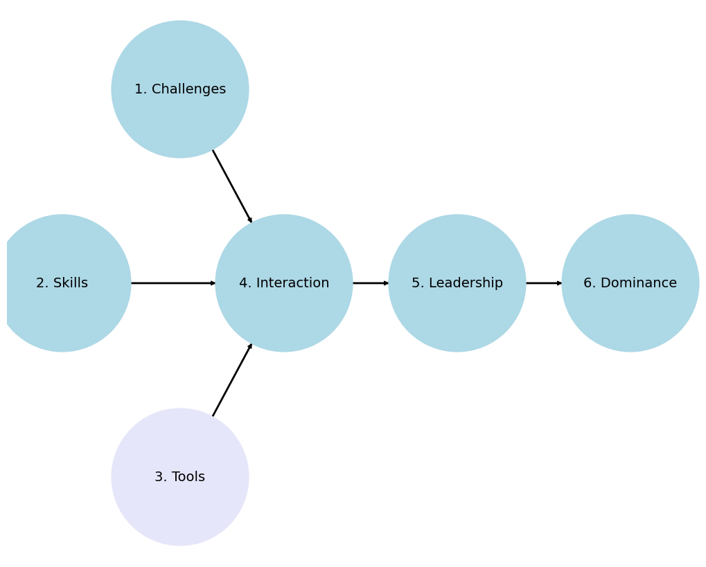

                            1. Challenges
                                         \
                            2. Skills -> 4. Interaction -> 5. Leadership -> 6. Dominance
                                         /
                                         3. Tools

### Personal 1, 2, 3 :: `Root, 3rd, 5th, ♭♭7, 9th` 
   - Revenant

### Interpersonal [Sing](https://en.wikisource.org/wiki/An_Attempt_at_Self-Criticism#3) O Muse 4  :: `11th, 13th`
   - [Macbeth](https://abikesa.github.io/henryv/)
     
### Group [5](https://abikesa.github.io/homage-reharm/), 6 :: `♭9,♯9,♯11,♭13`
   - Tempest
 
   

            1. Inidivual/Passion/Challenges
                                           \
                           2. Knowledge -> 4. Communication -> 5. Team/Network/Leadership/Decisions/Feedback/Professionalism -> 6. Accomplishments/Exceptional
                                           /
                                           3. Technical/Skills/Abilities

